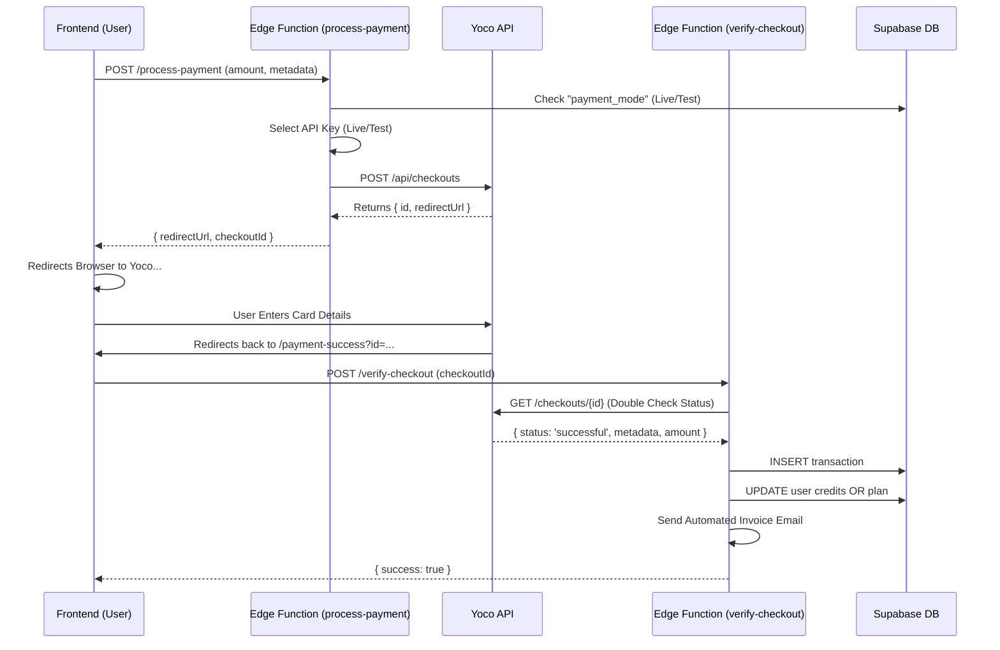

# 💳 Yoco Integration Report: HR CoPilot (Pty) Ltd

**Version:** 1.0 (Post-Audit RC1)
**Date:** 2026-01-19
**Prepared By:** Chief of Staff Agent

---

## 1. Overview
The payment system uses **Yoco's Redirect Checkout** flow (Server-to-Server). This method was chosen for security (no card data touches our frontend) and compliance. The frontend initiates a request, gets a redirect URL, sends the user to Yoco's secure page, and verifies the result via a backend "handshake" upon return.

---

## 2. Architecture Diagram

---

## 3. Component Breakdown

### A. Frontend (`services/paymentService.ts`)
- **Role:** The bridge between the UI and Supabase Edge Functions.
- **Key Methods:**
    - `processPayment()`: Calls the `process-payment` function.
    - `verifyCheckout()`: Calls the `verify-checkout` function.

### B. UI Components
1.  **`components/PaymentModal.tsx`**:
    - Displays a "Preparing Payment" spinner.
    - Captures `checkoutId` in `localStorage` (`pendingCheckoutId`) before redirecting. *Critical fallback if URL params are stripped.*
    - Redirects user to Yoco's URL.
2.  **`components/PaymentSuccessPage.tsx`**:
    - The landing page after Yoco.
    - Reads `id` from URL query, hash, or localStorage.
    - Triggers verification.
    - Forces a profile refresh (`refetchProfile`) so the user sees their new credits immediately.

### C. Backend (Edge Functions)

#### 1. `process-payment` (The Initiator)
-   **Security:** Checks `payment_mode` in `app_settings` (DB) to dynamically swap between `YOCO_SECRET_KEY_LIVE` and `YOCO_SECRET_KEY_TEST`.
-   **Payload:** Sanitizes metadata (userId, type, description) before sending to Yoco.
-   **Output:** Returns a `redirectUrl` and `checkoutId`.

#### 2. `verify-checkout` (The Arbiter)
This is the "Brain" of the operation. It performs **5 Critical Actions**:
1.  **Verification:** Calls Yoco API to confirm the status is actually `successful` (prevents spoofing).
2.  **Idempotency:** Checks `transactions` table to ensure we don't double-charge or double-credit for the same `checkoutId`.
3.  **Coupon Logic:** If a `couponCode` is present in metadata, it re-validates the coupon against the DB and applies the discount logic (Fixed vs Percentage).
4.  **Fulfillment:**
    -   **TopUp:** Increments `creditBalance`.
    -   **Subscription:**Updates `plan` to `'pro'`.
5.  **Invoicing:** Generates a HTML Invoice and emails it to the user immediately.

---

## 4. Configuration & Secrets
The system relies on the following **Supabase Secrets**:
-   `YOCO_SECRET_KEY_TEST`: Starting with `sk_test_...`
-   `YOCO_SECRET_KEY_LIVE`: Starting with `sk_live_...`
-   `SUPABASE_URL`
-   `SUPABASE_SERVICE_ROLE_KEY`

And a Database Setting:
-   Table: `app_settings`
-   Row: `key='payment_mode'`, `value='test'` OR `'live'`

---

## 5. Troubleshooting Guide

| Symptom | Probable Cause | Fix |
| :--- | :--- | :--- |
| **"Invalid Request" (400) on Checkout** | Missing `amountInCents` or `successUrl`. | Check `PaymentModal.tsx` payload. |
| **User charged but no credits** | `verify-checkout` failed or timeout. | Check Supabase Logs. User can email support with ID. |
| **"Payment status is created"** | User cancelled or didn't finish. | Yoco status is not yet 'successful'. |
| **Double Credits** | Idempotency check failed. | Check `external_id` unique constraint on `transactions` table. |

---

## 6. Future Recommendations
-   **Webhooks:** Currently, we rely on the client redirecting back to trigger verification. For robust durability (e.g., if user closes tab immediately after pay), implement a **Yoco Webhook** listener as a backup verification method.

---
**End of Report.**
